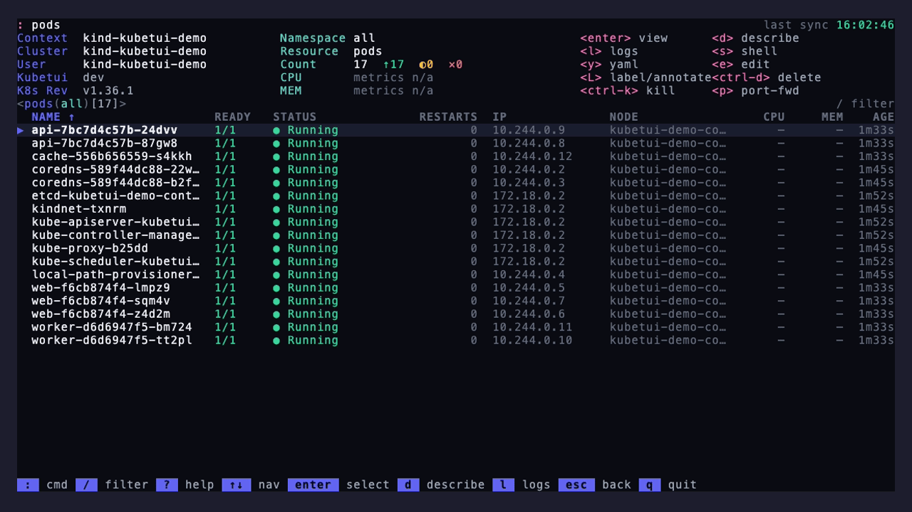
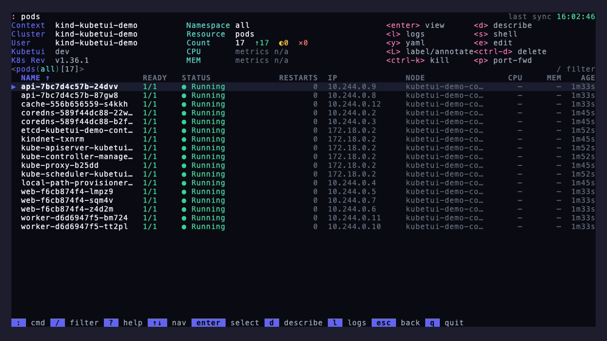
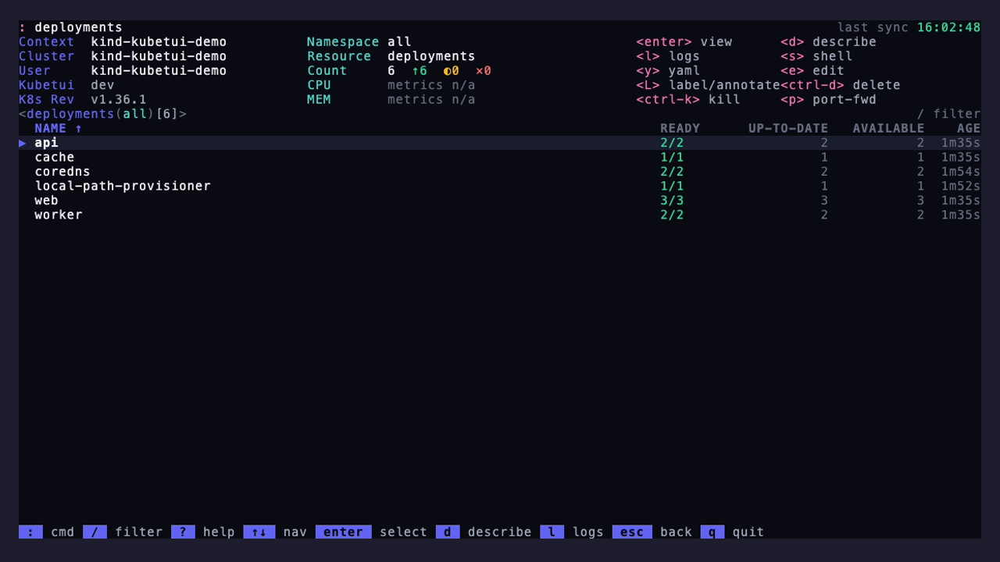
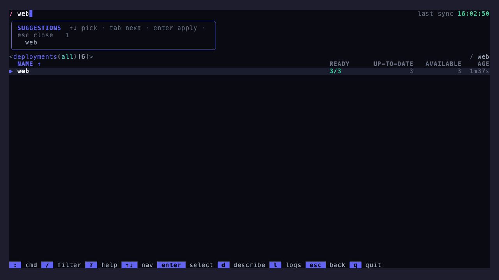

# kubetui

A full-screen **terminal UI for managing and monitoring Kubernetes clusters** — in the spirit of [k9s](https://k9scli.io/), written in Go with [Bubble Tea](https://charm.land). Browse **~45 built-in resource kinds plus any CRD**, tail logs, exec/debug into pods, scale/rollout/restart, drain nodes, `cp` files, port-forward, diff-and-apply YAML, and more — all from the keyboard.

**Plug-and-play:** point it at a kubeconfig and go. No cluster-side install, no operator, no sidecar, no extra binaries — kubetui speaks the standard Kubernetes API your cluster already exposes.



<!-- Generate this GIF (and the stills) with: vhs docs/demo.tape  (see "Screenshots" below) -->

---

## Features

- **Live resource tables** — workloads (pods, deployments, statefulsets, daemonsets, replicasets, jobs, cronjobs), services/ingresses/network-policies/endpoint-slices, config & storage (configmaps, secrets, PVCs/PVs, storage classes, CSI drivers/nodes, volume attachments, CSI storage capacities), RBAC (roles/bindings, cluster roles/bindings, service accounts), scheduling & flow-control (priority classes, runtime classes, priority-level configs, flow schemas, leases), admission (validating/mutating webhook configs and admission policies + bindings), certificate signing requests, HPAs, PDBs, quotas, limit ranges, nodes, namespaces, events — driven by watch and coalesced for a smooth UI.
- **Generic CRD browser** — `:crds` lists CustomResourceDefinitions; open any of them (or `:<plural>.<group>`, or a bare `:<plural>` resolved via discovery) and browse its instances with **kubectl-identical columns** via the server-side Table protocol. No per-CRD code.
- **Logs** — follow a single pod/container or **every pod of a workload merged** with color-coded `[pod]` tags. Toggle wrap, save to file, view previous (terminated) logs, pick a container, set tail count.
- **Exec & debug** — `s` opens an interactive shell in a pod (WebSocket→SPDY, raw-terminal handoff, resize); `D` attaches an **ephemeral debug container** (great for distroless) or a privileged **node debug** pod.
- **File copy** — `C` copies files to/from a pod (`kubectl cp` parity, tar over exec).
- **Workload actions** — scale, rolling restart, rollout status, **rollout history + undo**, **pause/resume**, and **`kubectl set`** (image / env / resources / service-account) + raw patch (`=`).
- **CronJobs** — trigger a run now (`kubectl create job --from` parity) and suspend/resume (`enter`).
- **Node operations** — cordon, uncordon, drain (skips DaemonSet/mirror pods), **taint** add/remove, and **`:nodetop`** CPU/MEM usage.
- **Port-forward** — `p` on a pod, **service, or workload** (resolves a ready backing pod).
- **Inspect & mutate** — YAML view, kubectl-style describe, `$EDITOR` edit (server-side apply), **label/annotate** (`L`), delete / force-kill, and **bulk multi-select** (`space`) for batch delete.
- **Apply from YAML** — `:apply` opens `$EDITOR` and **previews a server-side dry-run diff** before applying (multi-doc, any kind including CRDs).
- **CSR approve/deny** — `a` / `x` on a CertificateSigningRequest.
- **API discovery & docs** — `:explain <kind[.field.path]>` renders OpenAPI field docs; `:api-resources` / `:api-versions` list what the cluster serves.
- **Navigation** — command palette (`:`), context picker, namespace + **workload → pods** drill-in, runtime **sort**, and a **multi-term filter** (`/`) with column scoping, regex, and a suggestion dropdown.
- **Secrets are safe** — values are hidden in the table and redacted in YAML; `enter` reveals a chosen key on demand.
- **`:whoami`** — resolved identity + a `can-i` access-review grid.
- **Capsule dashboard** — `:tenants` renders a [Capsule](https://projectcapsule.dev/) multi-tenancy view (tier, quota bars, owner, status) when the operator is installed.
- **Metrics** (optional) — per-pod CPU/MEM columns and cluster gauges when `metrics-server` is installed.
- **Read-only mode** — disable every mutating action with one config flag.

### Under the hood

- **Resilient reads** — the rendered table is never cleared on a network blip; it's marked *stale* and keeps rendering while the watch reconnects. Terminal errors (`401`/`403`/TLS) stop retrying and surface an actionable banner.
- **Independently restartable views** — one informer per kind, so an RBAC `403` on one resource degrades only that view.
- **Fire-and-observe writes** — a mutation never edits the local cache; the resulting watch event does. A failed write shows a toast and leaves the read state untouched.

See [`docs/ARCHITECTURE.md`](docs/ARCHITECTURE.md) for the full design.

---

## Screenshots

| Pods | Deployments |
|---|---|
|  |  |
| **Multi-term filter** | **Demo** |
|  |  |

These are generated reproducibly with [VHS](https://github.com/charmbracelet/vhs) — no manual capture:

```bash
brew install vhs
vhs docs/demo.tape     # → docs/screenshots/{pods,deployments,filter}.png + demo.gif
```

Point kubetui at a demo/dev cluster with representative resources first, then commit the generated images under `docs/screenshots/`.

---

## Install

### Homebrew

```bash
brew install 14f3v/tap/kubetui
```

The formula lives in [`14f3v/homebrew-tap`](https://github.com/14f3v/homebrew-tap) and is published automatically on each release.

### Download a binary

Grab the archive for your OS/arch from [Releases](https://github.com/14f3v/kubectl-tui/releases), extract it, and put `kubetui` on your `PATH`:

```bash
install -m 0755 kubetui /usr/local/bin/kubetui
```

### `go install`

```bash
go install github.com/14f3v/kubectl-tui/cmd/kubetui@latest
```

### Build from source

Requires **Go 1.26+**.

```bash
git clone https://github.com/14f3v/kubectl-tui.git
cd kubectl-tui
go build -o kubetui ./cmd/kubetui
./kubetui
```

---

## Quick start

```bash
# Use your current-context from ~/.kube/config (or $KUBECONFIG)
kubetui

# Point at a specific kubeconfig and/or context
kubetui -kubeconfig /path/to/kubeconfig
kubetui -context staging

# Open on a specific view
kubetui -kind deployments
```

Then:

- Press `:` and type a resource (e.g. `:deploy`) — the palette suggests matches as you type.
- Use `↑`/`↓` (or `j`/`k`) to move, `enter` to drill in, `esc` to go back.
- Press `?` any time for in-app help, `q` to quit.

### CLI flags

| Flag | Default | Description |
|---|---|---|
| `-kubeconfig <path>` | — | kubeconfig file (overrides `$KUBECONFIG` and `~/.kube/config`) |
| `-context <name>` | current-context | kubeconfig context to use |
| `-kind <kind>` | `pods` | initial resource view |
| `-version` | — | print version and exit |

---

## Usage

### The command line (`:`)

Press `:` to open the command palette, then type a resource name or alias and `enter`. The dropdown filters as you type; `↑`/`↓` select and `Tab` completes. Arguments work too (`:pods kube-system`).

```
:pods        :deploy        :svc         :nodes        :ns
:secrets     :hpa           :ingress     :crds         :ctx
```

Fully-qualified custom resources work too:

```
:certificates.cert-manager.io
:applications.argoproj.io
```

### Filtering (`/`)

Press `/` and filter the current table live. The filter is a set of **whitespace-separated terms combined with AND** — a row is kept only if it matches every term — so you can progressively narrow a list. A **suggestion dropdown** shows candidate values as you type; `↑`/`↓` and `Tab` cycle through them.

Each term is `[!][col:][~]value`:

| Syntax | Meaning |
|---|---|
| `web` | case-insensitive **substring** (matches namespace, name, or any cell) |
| `web prod` | multiple terms → **AND** (contains `web` *and* `prod`) |
| `ns:kube-system` | **column-scoped** — `ns:`/`name:` always, or any column title (`status:`, `image:`, …) |
| `~^web-\d+$` | leading `~` → case-insensitive **regex** |
| `!running` | leading `!` → **invert** (must NOT match) |
| `status:running ns:prod !error` | mix scopes, regex, and negation |

An unknown `col:` is treated as literal text (so `nginx:1.25` matches that image tag). `esc` clears the filter.

### Sorting

| Key | Action |
|---|---|
| `>` | cycle the **sort column** |
| `<` | toggle **sort direction** |

### Namespaces & contexts

- `0`–`9` — jump namespace: `0` = all namespaces, `1`–`9` = your configured favorites (see [Configuration](#configuration)).
- `enter` on a **namespace** row — open that namespace's pods.
- `:ctx` — open the **context picker** (or `:ctx <name>` to switch directly). Switching rebuilds the session.

### Resource actions

Available on resource tables (gated by kind, and disabled in read-only mode):

| Key | Action | Applies to |
|---|---|---|
| `enter` | drill in | pod→containers · **workload→pods** · secret→reveal · cronjob→menu · node→ops · namespace→pods |
| `d` | describe (kubectl-style) | most kinds |
| `y` | YAML view (`/` to search) | all |
| `l` | logs | pods · workloads (merged multi-pod) |
| `s` | shell (exec) | pods |
| `D` | debug — ephemeral container / node debug pod | pods · nodes |
| `C` | copy files to/from (`kubectl cp`) | pods |
| `e` | edit in `$EDITOR` (server-side apply) | all |
| `=` | set image/env/resources/service-account · raw patch | pods, workloads |
| `L` | label / annotate | all |
| `p` | port-forward (resolves a ready pod) | pods, services, workloads |
| `S` | scale replicas | Deployments, StatefulSets, ReplicaSets |
| `r` | rollout menu (restart / status / history+undo / pause·resume) | Deployments, StatefulSets, DaemonSets |
| `a` · `x` | approve · deny | CertificateSigningRequests |
| `space` | select row (for bulk actions) | all |
| `ctrl+d` | delete (all selected, or the row) | all |
| `ctrl+k` | kill (force delete, grace 0) | all |

### Logs

Open with `l`. On a **workload**, logs from all matching pods are merged with color-coded `[pod]` tags.

| Key | Action |
|---|---|
| `j`/`k`, `PgUp`/`PgDn`, `g`/`G` | scroll |
| `f` | toggle follow (tail) |
| `w` | toggle soft-wrap |
| `C` | save buffer to a file |
| `p` | previous (terminated) container logs *(single pod)* |
| `c` | container picker *(single pod)* |
| `t` | set tail line count *(single pod)* |
| `esc` | back |

### Node operations

`enter` on a node opens a menu:

- **Cordon** / **Uncordon** — mark (un)schedulable.
- **Drain** — cordon, then evict pods (DaemonSet-owned and mirror pods are skipped). Confirm-gated.

### Rollout history & undo

`r` on a Deployment/StatefulSet/DaemonSet → **History** lists revisions (newest first, current marked). `enter` rolls back to the selected revision (confirm-gated). **Restart** and **Status** are in the same menu.

### Apply from YAML

`:apply` opens `$EDITOR` on a blank manifest; save & quit to **server-side apply** it. Multi-document YAML is supported, and it works for any kind — including CRDs — resolving each object's type via discovery.

### Secrets

The secrets table only shows the type and data-key count. `enter` opens a reveal view where keys are masked; `enter` on a key toggles its cleartext value in memory. The YAML view redacts values.

### Identity

`:whoami` shows the resolved user/groups (via `SelfSubjectReview`) and a `can-i` grid (list/create/delete pods, get secrets, list nodes, cluster-admin).

---

## Command reference

| Command | Aliases | Opens |
|---|---|---|
| `:pods` | `po`, `pod` | Pods |
| `:deployments` | `deploy`, `dp` | Deployments |
| `:statefulsets` | `sts` | StatefulSets |
| `:daemonsets` | `ds` | DaemonSets |
| `:replicasets` | `rs` | ReplicaSets |
| `:jobs` | `job` | Jobs |
| `:cronjobs` | `cj` | CronJobs |
| `:services` | `svc` | Services |
| `:ingresses` | `ing` | Ingresses |
| `:networkpolicies` | `netpol` | NetworkPolicies |
| `:endpointslices` | `eps` | EndpointSlices |
| `:configmaps` | `cm` | ConfigMaps |
| `:secrets` | `secret` | Secrets |
| `:persistentvolumeclaims` | `pvc` | PVCs |
| `:persistentvolumes` | `pv` | PVs |
| `:storageclasses` | `sc` | StorageClasses |
| `:serviceaccounts` | `sa` | ServiceAccounts |
| `:roles` · `:rolebindings` | — | RBAC (namespaced) |
| `:clusterroles` · `:clusterrolebindings` | `crb` | RBAC (cluster) |
| `:horizontalpodautoscalers` | `hpa` | HPAs |
| `:poddisruptionbudgets` | `pdb` | PDBs |
| `:resourcequotas` | `quota` | ResourceQuotas |
| `:limitranges` | `limits` | LimitRanges |
| `:nodes` | `no`, `node` | Nodes |
| `:namespaces` | `ns` | Namespaces |
| `:events` | `ev`, `event` | Events |
| `:portforwards` | `pf` | Active port-forwards |
| `:crds` | `crd` | CustomResourceDefinitions |
| `:<plural>.<group>` | — | Any resource by GVR (e.g. `certificates.cert-manager.io`) |
| `:certificatesigningrequests` | `csr` | CSRs (`a` approve / `x` deny) |
| `:apply` | `create` | Apply YAML from `$EDITOR` (dry-run diff first) |
| `:nodetop` | `topnodes` | Node CPU/memory usage |
| `:explain <kind[.field]>` | `exp` | OpenAPI field docs (e.g. `:explain pod.spec.containers`) |
| `:api-resources` · `:api-versions` | — | Served resources / group-versions |
| `:ctx` | `context` | Context picker (or `:ctx <name>`) |
| `:whoami` | `auth` | Identity + access review |
| `:tenants` | `tnt` | Capsule tenant dashboard |
| `:q` | `quit`, `exit` | Quit |

> Every built-in kind has a command — beyond those above, that includes `:priorityclasses` (`pc`), `:runtimeclasses`, `:ingressclasses`, `:leases`, and the admission (`:vwc`, `:mwc`, `:vap`, …), flow-control (`:flowschemas`, `:prioritylevelconfigurations`), and CSI-internal (`:csidrivers`, `:csinodes`, `:volumeattachments`, `:csistoragecapacities`) kinds. Press `:` and start typing — the palette suggests matches.

### Global keys

| Key | Action |
|---|---|
| `:` | command palette |
| `/` | filter |
| `?` | help |
| `esc` | back / clear filter |
| `q` · `ctrl+c` | quit · force-quit |
| `0`–`9` | namespace (0 = all, 1–9 = favorites) |

---

## Configuration

kubetui reads an optional config file at **`~/.config/kubetui/config.yaml`** (or `$XDG_CONFIG_HOME/kubetui/config.yaml`). A missing or malformed file falls back to defaults.

```yaml
accent: indigo          # indigo | green | teal | pink | #RRGGBB
density: comfortable    # comfortable | compact
readOnly: false         # true disables every mutating action
tierLabel: tier         # label key shown as the TIER column (Capsule tenants)
favorites:              # namespaces on digit keys 1-9
  - kube-system
  - default
  - monitoring
```

| Key | Default | Notes |
|---|---|---|
| `accent` | `indigo` | preset name or a hex color |
| `density` | `comfortable` | `compact` removes inter-column padding |
| `readOnly` | `false` | when `true`, scale/edit/delete/drain/apply/etc. are refused |
| `tierLabel` | `tier` | tenant label key for the TIER column |
| `favorites` | — | namespaces surfaced by the `1`–`9` keys |

---

## Requirements & authentication

- **A kubeconfig.** Resolution order: `-kubeconfig` flag → `$KUBECONFIG` (colon-separated files are merged) → `~/.kube/config`. `-context` overrides the current-context; `:ctx` switches live.
- **Standard auth is supported** — client certificates, tokens, OIDC, and **exec credential plugins** (Teleport `tsh`, `aws eks get-token`, `gke-gcloud-auth-plugin`, etc.) all work through client-go's normal config resolution.
- **RBAC.** kubetui only does what your credentials allow; a forbidden resource shows a clear banner rather than failing. Mutating actions preflight a `SelfSubjectAccessReview` where possible.
- **Metrics** (CPU/MEM columns, cluster gauges) require `metrics-server`; they're simply absent otherwise.
- No cluster-side components are installed. The CRD browser uses the built-in Table protocol and discovery — the same APIs `kubectl get` uses.

---

## Development

```bash
go build ./...          # build everything
go test ./...           # run the test suite
go vet ./...            # vet
gofmt -l internal cmd   # formatting check
```

### Layout

```
cmd/kubetui/            entrypoint
internal/app/           root Bubble Tea model: chrome, command line, keymap, routing
internal/view/          pages (one per kind + drill-ins, pickers, menus)
internal/engine/        watch/informer engine + coalescing; columns/ = per-kind projectors
internal/component/     the table component (widths, sort, render)
internal/action/        cluster actions: logstream, execshell, editor, write, scale,
                        rollout, nodeops, apply (+dry-run diff), inspect, portfwd/portforward,
                        cp, debug, setspec, metaedit, cronjob, csr, dynbrowse (CRD/Table),
                        explain, apidisco
internal/k8s/           session: kubeconfig, clients, factory registration
internal/style/         theme (design tokens + prebuilt lipgloss styles)
internal/config/        config file loading
internal/metrics/       optional metrics-server integration
internal/tenant/        Capsule tenant dashboard
```

Adding a new **built-in** kind is a `columns/<kind>.go` projector plus a line in each of four registries (`view/kinds.go`, `k8s/session.go`, `action/inspect/inspect.go`, `k8s/resources.go`). Arbitrary CRDs need no code — they render through the Table protocol.

---

## Notes

- Built with `charm.land/bubbletea`, `charm.land/lipgloss`, `charm.land/bubbles` (v2) and `k8s.io/client-go`.
- kubeconfigs and secrets are never written to disk by kubetui; `.gitignore` excludes local kubeconfig files.

## License

Licensed under the [Apache License 2.0](LICENSE).
